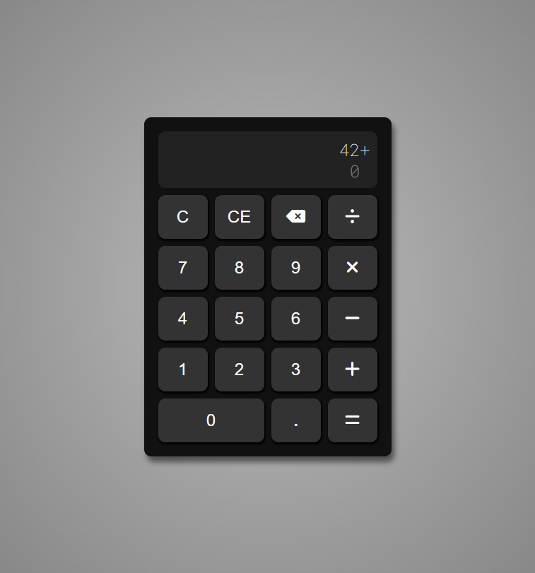

# Calculator

This is my entry for [The Odin Project](https://www.theodinproject.com/)'s calculator project.
[Link to the Assignment](https://www.theodinproject.com/paths/foundations/courses/foundations/lessons/calculator).  
Made with HTML, CSS and JS.

## Preview:

-   Experiment with the live version [here](https://madmaia3d.github.io/odin-calculator/).

## Tools used:

-   Visual Studio Code
-   Git + GitHub
-   Git Bash for terminal commands
-   Google's Chrome and Microsoft's Edge

## Thoughts:

This was the first curriculum project that I really struggled with. I ended up redoing it twice, however, with each iteration the process got faster and with better results. This taught me that not everything goes well on the first try, sometimes you have to experiment different paths until you succeed.
Learning is a process.

This was the first real project in which I used CSS Grid.

## Outcomes:

-   Practiced CSS Grid basics.
-   LI got used to using classes and the bind method.
-   I practiced manipulating numeric strings.
-   Developed my problem solving skills.

## Feature ideas that can be implement in the future:

-   Button to invert signal.
-   Keyboard input.

---

This project is part of [The Odin Project](https://www.theodinproject.com/) curriculum.
